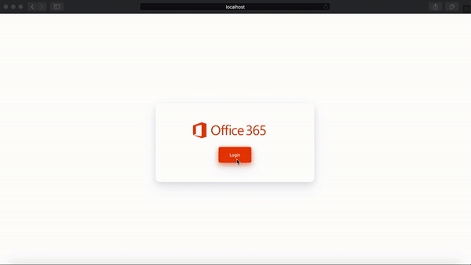

# Vuejs Microsoft Office 365 Login


### How to use
First run 
```
npm install
```
Then go to "Store.js" and change basUrl with your API server, and add client_id from your microsoft Azure dashboard
## Demo
```
  baseUrl: 'http://localhost:8000', // Your API domain
  providers: {
    live: {
      clientId: '', // change with your Microsoft office Client ID
      redirectUri: 'http://localhost:8080' ,// Your client app URL
      authorizationEndpoint : "https://login.microsoftonline.com/common/oauth2/v2.0/authorize/",
      scope: ["openid","profile","offline_access","User.Read"],
      scopeDelimiter: ' ',
      oauthType: '2.0',
    }
  }
```

### Run the app
```
npm run serve
```

